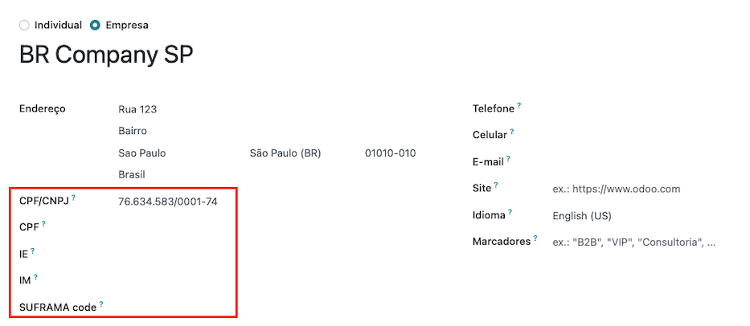
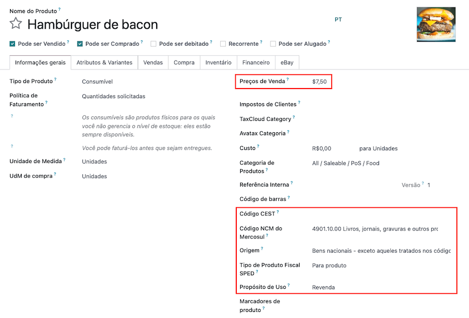
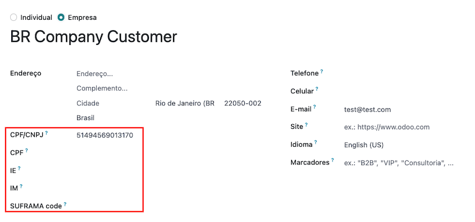
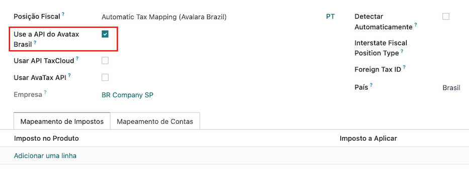
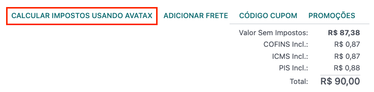
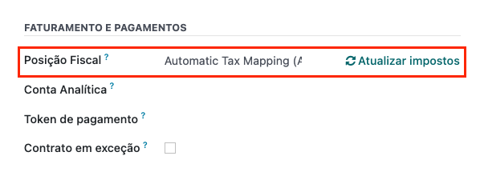
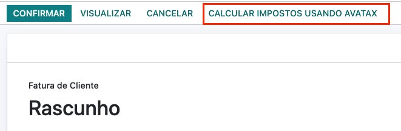
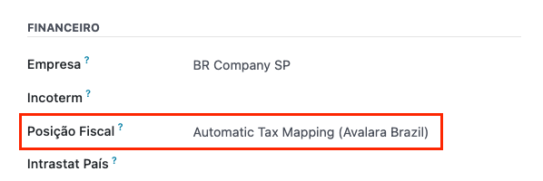

======
Brazil
======

.. |IAP| replace:: :abbr:`IAP (In-App-Purchase)`
.. |SO| replace:: :abbr:`SO (Sales Order)`

Introduction
============

With the Brazilian localization you can automatically compute sales taxes for goods using Avatax
(Avalara) through API calls and you can also configure taxes for services.

For the goods tax computation part, you need to configure the contacts, company, products, and
create an account in AvaTax from the Odoo general settings.

For the services taxes, you can create and configure them from Odoo directly without the need of
computing them with AvaTax.

The localization also includes a chart of account and taxes created as a template that can be
modified if needed.

Configuration
=============

Modules installation
--------------------

:ref:`Install <general/install>` the following modules to get all the features of the Brazilian
localization:

.. list-table::
   :header-rows: 1
   :widths: 25 25 50

   * - Name
     - Technical name
     - Description
   * - :guilabel:`Brazilian - Accounting`
     - `l10n_br`
     - Default :ref:`fiscal localization package <fiscal_localizations/packages>` adds accounting
       characteristics for the Brazilian localization, which represent the minimum configuration
       required for a company to operate in Brazil. The module's installation automatically loads:
       chart of accounts, taxes, and include required fields to properly configure the contact.
   * - :guilabel:`Brazil - Accounting Reports`
     - `l10n_br_reports`
     - Adds a simple tax report that helps check the tax amount per tax group in a given period of
       time. Also adds the P&L and BS adapted for the Brazilian market.
   * - :guilabel:`Avatax Brazil`
     - `l10n_br_avatax`
     - Add Brazilian tax calculation via Avatax and all necessary fields needed to configure Odoo in
       order to properly use Avatax and send the needed fiscal information to retrieve the correct
       taxes.
   * - :guilabel:`Avatax for SOs in Brazil`
     - `l10n_br_avatax_sale`
     - Same as the `l10n_br_avatax` module with the extension to the sales order module.

Configure your company
----------------------

To configure your company information, go to the :menuselection:`Contacts` app and search the name
given to your company or activate :ref:`developer mode <developer-mode>` and go to
:menuselection:`Company --> Contact` and then edit the contact.

1. Select the :guilabel:`Company` option at the top of the page. Then, configure the following
   fields:

   - :guilabel:`Name`
   - :guilabel:`Address` (add :guilabel:`City`, :guilabel:`State`, :guilabel:`Zip Code`,
     :guilabel:`Country`)
   - Tax ID (:guilabel:`CNPJ`)
   - :guilabel:`IE`
   - :guilabel:`IM`
   - :guilabel:`SUFRAMA code` (if applicable)
   - :guilabel:`Phone`
   - :guilabel:`Email`

2. Configure the :guilabel:`Fiscal Information` within the :guilabel:`Sales and Purchase` tab:

   - Add the :guilabel:`Fiscal Position` for :ref:`Avatax Brazil <brazil/fiscal-positions>`.
   - :guilabel:`Tax Regime`
   - :guilabel:`ICMS Taxpayer Type`
   - :guilabel:`Main Activity Sector`

.. image:: brazil/contact-fiscal-configuration.png
  :align: center
  :alt: Company fiscal configuration.

Finally, upload a company logo and save the contact.

.. note::
   If you are a simplified regime you need to configure the ICMS rate in
   :menuselection:`Accounting --> Configuration --> Settings --> Taxes --> Avatax Brazil`.

Configure Avatax integration
----------------------------

Avatax - aka Avalara - is a tax calculation provider that can be integrated in Odoo to automatically
compute taxes taking into account the company, contact (customer), product, and transactions
information to retrieve the correct tax to be used.

To use this integration, Odoo uses the In-App-Purchase (IAP) model, in order to buy credits to be
used to compute taxes. Every time you compute taxes, an API call is made, using credits from the
|IAP| credits balance.

Odoo is a certified partner of Avalara Brazil, which means that workflows covered within the scope
of the integration was reviewed by Avlara experts.

IAP (Odoo In-App Purchase)
~~~~~~~~~~~~~~~~~~~~~~~~~~

|IAP| gives access to additional services through Odoo. In the case of Brazil it allows you to
compute taxes to be used on sales operations.

If you want to know more about this service, you can visit the Odoo official :doc:`IAP documentation
</applications/general/in_app_purchase>`.

How does it work?
*****************

The service requires credits in order to process your tax computations. Odoo provides 500 credits
for free in new databases. After these credits are consumed, you need to buy a credit package.

.. list-table::
   :header-rows: 1
   :widths: 50 50

   * - Credits
     - EUR
   * - 500
     - 5
   * - 1,000
     - 10
   * - 5,000
     - 47
   * - 10,000
     - 94

The credits are consumed per each API call (tax computation) that is sent to Avatax.

Credential configuration
~~~~~~~~~~~~~~~~~~~~~~~~

To activate Avatax in Odoo you need to create an account, to do so go to :menuselection:`Accounting
--> Configuration --> Settings --> Taxes` and add the email address you want to use to log in to the
Avatax portal, and the click on :guilabel:`Create a new account`. This email will be used as the
administrator email address in Avatax.

After you create the account from Odoo, you need to go to the Avalara Portal to set up your
password.

.. warning::
   Only create an account with the Avatax portal email you want to use in production when you are in
   the database that will have your production transactions (real transactions). If you want to
   test, you can use a dummy email (not a real one) to create the account. This will bring testing
   credentials for you to test on a testing or sandbox database.

.. tip::
   If you do not know how to log in for the first time into the Avatax portal, `click here
   <https://drive.google.com/file/d/1jPtKzilfLrfdRXyPGacQNr6i2zvQvoOd/view?usp=sharing>`_. If you
   want to start using Avatax in Odoo without creating a password and accessing the Avalara Portal,
   you will be able to. From Odoo the only step needed is creating an account to start using the
   Avalara Tax Computation Engine.

.. image:: brazil/avatax-account-configuration.png
   :align: center
   :alt: Avatax account configuration.

.. note::
   You can transfer API credentials. Use this only when you already created an account in another
   Odoo instance and wish to reuse it.

Configure master data
---------------------

Chart of accounts
~~~~~~~~~~~~~~~~~

The :doc:`chart of accounts </applications/finance/accounting/get_started/chart_of_accounts>` is
installed by default as part of the set of data included in the localization module, the accounts
are mapped automatically in taxes, default account payable, and default account receivable.

The chart of accounts for Brazil is based on the SPED CoA, this gives a baseline of the accounts
needed in Brazil.

You can add or delete accounts according to the company's needs.

Taxes
~~~~~

Taxes will be automatically created when installing the Brazilian localization. Taxes will be
already configured, and some of them will be used by Avalara when computing taxes on the sale order
or invoice.

Taxes can be edited or more taxes can be added, for example, some taxes used for services need to be
manually added and configure, as depending on the city that you are offering the service, the rate
may differ, and **taxes attached to services will not be computed by Avatax**, only good taxes are
computed.

When adding a tax used for a service that is included in the final price - when the tax is not added
or subtracted on top of the product price - then you need to configure the :guilabel:`Tax
Computation` to :guilabel:`Percentage of Price Tax Included`, and on the :guilabel:`Advanced
Options` tab check the :guilabel:`Included in Price` option.

For more information on how to configure taxes to better fit your needs, please go to the
:doc:`taxes functional documentation </applications/finance/accounting/taxes>`.

.. image:: brazil/tax-configuration.png
   :align: center
   :alt: Tax configuration.

.. warning::
   Do not delete taxes, as they are used for the Avatax tax computation. If deleted, Odoo will
   create them again when used in a |SO| or invoice and computing taxes with Avatax. But the account
   used to register the tax needs to be re-configured inside the :menuselection:`Tax Configurations
   --> Definition tab --> Invoice and Credit Note accounts`.

Products
~~~~~~~~

The Avatax integration is available on sale orders and invoices with the included Avatax fiscal
position.

Before using the integration, specify the following information on the product:

- :guilabel:`CEST Code`
- :guilabel:`Mercosul NCM Code`
- :guilabel:`Source of Origin`
- :guilabel:`SPED Fiscal Product Type`
- :guilabel:`Purpose of Use`
- :guilabel:`Sales Price`

.. note::
   Odoo will create automatically three products to be used for transportation costs associated with
   the sales. These are named `Freight`, `Insurance`, and `Other Costs`, they are already
   configured, if more need to be created, duplicate and use the same configuration (configuration
   needed: :guilabel:`Product Type` `Service`, :guilabel:`Transportation Cost Type` `Insurance`,
   `Freight`, or `Other Costs`)

Contacts
~~~~~~~~

Before using the integration, specify the following information on the contact:

1. General information about the contact:

   - Check the :guilabel:`Company` option on top if it is a contact with tax ID (CNPJ), or check
     :guilabel:`Individual` if it is a contact with CPF.
   - :guilabel:`Name`
   - :guilabel:`Address`: :guilabel:`Zip Code` is a required field to properly compute taxes.
   - :guilabel:`Tax ID` or :guilabel:`CPF`: depending on the case complete with the number.
   - :guilabel:`IE`: state tax identification number.
   - :guilabel:`IM`: municipa tax identification number.
   - :guilabel:`SUFRAMA code`: SUFRAMA registration number.
   - :guilabel:`Phone`
   - :guilabel:`Email`

2. Fiscal information about the contact:

   - :guilabel:`Fiscal Position`: add the Avatax fiscal position to automatically compute taxes on
     sale orders and invoices.
   - :guilabel:`Tax Regime`: federal tax regime.
   - :guilabel:`ICMS Taxpayer Type`: taxpayer type informs whether the contact is within the ICMS
     regime, if it is exempt, or if it is a non-taxpayer.
   - :guilabel:`Main Activity Sector`: list of main activity sectors of the contact.

.. image:: brazil/contact-fiscal-configuration.png
  :align: center
  :alt: Contact fiscal configuration.

.. _brazil/fiscal-positions:

Fiscal positions
~~~~~~~~~~~~~~~~

To compute taxes on sale orders and invoices, it is necessary to have a :guilabel:`Fiscal Position`
with the :guilabel:`Detect Automatically` and the :guilabel:`Use AvaTax API` selected.

The :guilabel:`Fiscal Position` can be configured on the contact or selected when creating a sale
order or an invoice.

Workflows
=========

Sales documents
---------------

API calls triggered by actions
~~~~~~~~~~~~~~~~~~~~~~~~~~~~~~

This section provides an overview of the actions that trigger API calls for tax computation. Please
note that each API call incurs a cost.

Sale order / quotation actions
******************************

The following actions performed on a sale order or quotation will trigger the API call for tax
computation:

- **Manual Trigger**: Users can manually initiate the tax computation by clicking on
  :guilabel:`Compute Taxes Using Avatax`.
- **Quotation Confirmation**: The API call is automatically triggered when a quotation is confirmed
  and transformed into a sale order.
- **Preview**: Clicking on the :guilabel:`Preview` button will trigger the API call.
- **Emailing Quotation / Sale Order**: The API call is triggered when a quotation or sale order is
  sent to a customer via email.
- **Online Quotation Access**: When a customer accesses the quotation online (via the portal view),
  the API call is triggered.

Invoice actions
***************

The following actions performed on an invoice will trigger the API call for tax computation:

- **Manual Trigger**: Users can manually initiate the tax computation by clicking on
  :guilabel:`Compute Taxes Using Avatax`.
- **Preview**: Clicking on the :guilabel:`Preview` button will trigger the API call.
- **Online Invoice Access**: When a customer accesses the invoice online (via the portal view), the
  API call is triggered.

Please remember that each API call has an associated cost. Be mindful of the actions that trigger
these calls to manage costs effectively.

Tax calculation on sales orders
~~~~~~~~~~~~~~~~~~~~~~~~~~~~~~~

Automatically calculate taxes on Odoo quotations and sale orders with Avatax by confirming the
document, or clicking on the compute taxes with Avatax button.

Check that the Avatax :guilabel:`Fiscal Position` is selected in the quotation and sale order before
computing taxes.

.. seealso::
   :doc:`Fiscal positions (tax and account mapping)
   </applications/finance/accounting/taxes/fiscal_positions>`

Tax calculation on invoices
~~~~~~~~~~~~~~~~~~~~~~~~~~~

Automatically calculate taxes on Odoo invoices with Avatax by confirming the document, or clicking
on the :guilabel:`Compute Taxes with Avatax` button.

Check that the Avatax :guilabel:`Fiscal Position` is selected on the invoice before computing taxes.

