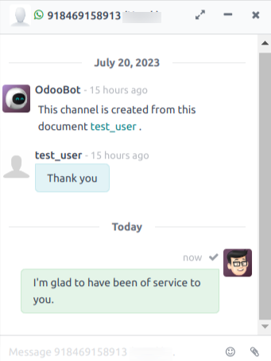
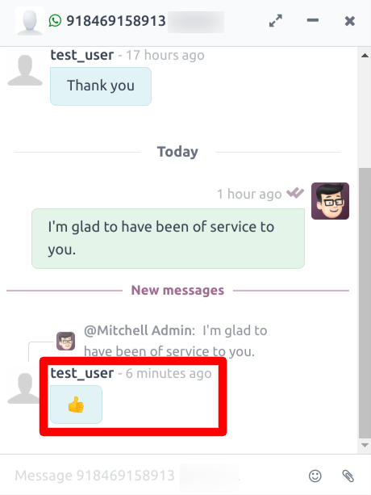

=================================
Chat With Customer Using Template
=================================

Once You :doc:`Configure WhatsApp Template  <../template/template_configuration>` in your
Odoo database. Now You can send the Template To Your end-client through Whatsapp Message.

.. whatsapp/send_first_document_to_customer:

Send First Document To Customer
===============================

Create a :doc:`Template  <../template/template_configuration>` For `Contacts` Model. So user
will be able to see Whatsapp button in the **Chatter** of the form view of `Contacts`.

.. image:: chat_using_template/wapp-button-in-chatter.png
   :align: center
   :alt: Whatsapp button

Click on the button :guilabel:`WhatsApp`. Popup will open.

.. image:: chat_using_template/template-popup.png
   :align: center
   :alt: Template Popup

Select the template and click on the :guilabel:`Send Messsage`. After few seconds you can see the
`Logs` in the Chatter.

.. image:: chat_using_template/log-in-chatter.png
   :align: center
   :alt: Logs

.. whatsapp/response_to_customer:

Response to Customer
====================

Now Customer to whom bussiness has sent the Document must have received the Documnent in their
WhatsApp associated with the phone number of that Customer in Odoo database.

.. image:: chat_using_template/wapp-end-user-document.png
   :align: center
   :alt: Logs

.. image:: chat_using_template/wapp-inside.png
   :align: center
   :alt: Logs

.. whatsapp/chat_in_discuss:

Chat in Discuss
===============

Still There would be No Channel created in :guilabel:`Discuss` for that Document.

Now, Let's say Customer replies from their WhatsApp. It will create a new channel in **Discuss**
for that Document. Conversation beetween the Bussiness and Customer can be seen from this
channel. Such channel will exist till the **15 Days** since the last conversation from the
Customer.

.. image:: chat_using_template/wapp-reply.png
   :align: center
   :alt: No channel in Discuss

You will be able to see new channel is created for that Document.

.. image:: chat_using_template/new-channel.png
   :align: center
   :alt: Channel created in Discuss

You can see the replies from Whatsapp user in this channel.

.. image:: chat_using_template/reply-from-wapp.png
   :align: center
   :alt: Reply from WhatsApp in Discuss

You can reply to End-user from that channel. It will send the WhatsApp message to Customer.

.. image:: chat_using_template/thanks-msg.png
   :align: center
   :alt: WhatsApp message reply

Once WhatsApp User reads your message you can see your message getting double ticked in
**Discuss Chat**. It indicates that the your sent message has been read.

.. image:: chat_using_template/discuss-double-tick.png
   :align: center
   :alt: Double Tick

.. whatsapp/reaction:

WhatsApp Reaction
=================

WhatsApp User can send the **Emojis** to the Bussiness as well.

.. image:: chat_using_template/wapp-emoji-from-user.png
   :align: center
   :alt: Emoji From WhatsApp User

These **Emojis** will be shown to Related **Discuss** channel as well.

Bussiness can send the **Emojis** from **Discuss** to the WhatsApp user.

.. _whatsapp_app/unable_channel:

Existance Of Channel
====================

If There is no further reply from WhatsApp user in last 24 hours then it will unpin that
Document's Channel. You won't be able to send the message from **Discuss** through that
channel. In the case of Customer replies to the Bussiness within **15 days**, only such
channel will be accessible to chat.

.. image:: chat_using_template/channel-tenure.png
   :align: center
   :alt: Unable to msg from Discuss
