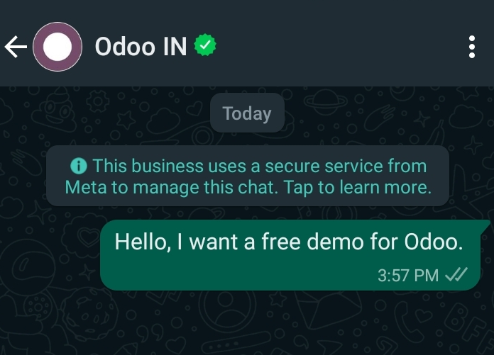
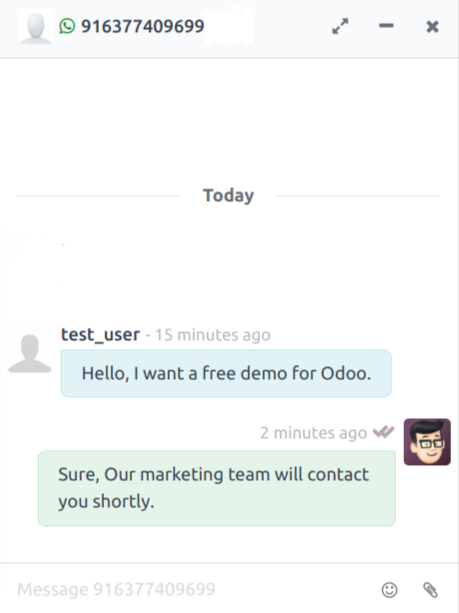

=========================
Chat Without Any Template
=========================

.. _whatsapp_app/chat_from_new_customer:

Customer Initiates the Chat
===========================

For instance, Customer got your WhatsApp Contact details from Advertisement or from a Website of a
Bussiness and now Customer directly contact the Bussiness through Whatsapp. Then `Partner` in the
name of that Customer will be created in your Odoo database.

New Channel in **Discuss** for that conversation will be created. you can keep track of that
Customer using that channel. Such channels will also get deactivated after the **15 Days** of
the last conversation from the Customer.

