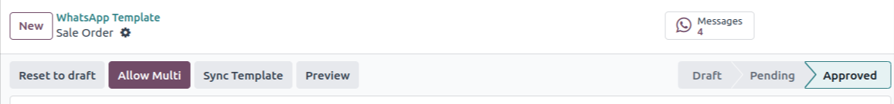
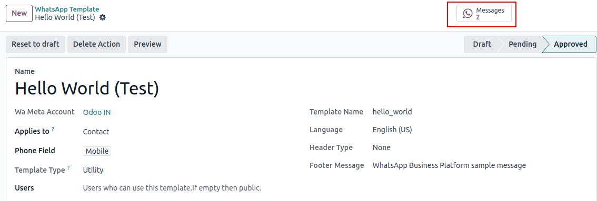

=========================
Get Started with WhatsApp
=========================

WhatsApp Template
=================

Go to :menuselection:`WhatsApp --> Template`. Here you can simply add your whatsApp Template.
By clicking on :guilabel:`New` adding credentials such as name, header type , footer message and
many more fields.

.. image:: template_configuration/new-template-create.png
   :align: center
   :alt: Add WhatsApp Account in Odoo

Template Configuration
----------------------

Fill out the below details.

.. image:: template_configuration/template_final.png
   :align: center
   :alt: View of the template page for Odoo WhatsApp

:guilabel:`Name`: This field is used to specify the name or title of the WhatsApp template.
It helps identify the type or purpose of the template.

:guilabel:`Applies To`: This field is used to determine that the current template implies to
which `Model`. i.e. Choosing :guilabel:`Sales Order` as :guilabel:`Applies To`  in the
template means that you can select this template only while you are sending the Documents from the
Sale Order.

:guilabel:`Phone Fields`:  It is a field selector which can select any field which can store the
phone number.
- If user has selected :guilabel:`Applies To` as per the above snapshot then while sending document
from :guilabel:`Sales Order` message will be send to the mobile number associated with customer
of the Sale order.

:guilabel:`Template Type`: There are 3 types of template
   #. :guilabel:`Authentication` - One-time passwords that your customers use to authenticate a
      transaction or login.
   #. :guilabel:`Marketing` - Promotions or information about your business, products or services.
      Or any message that isn't utility or authentication.
   #. :guilabel:`Utility` - Messages about a specific transaction, account, order or customer
      request.

:guilabel:`Users`: If we do not select any specific users, then everyone within the system can use
the template.

:guilabel:`Language`: The Language field is used to specify the language in which the
WhatsApp template is written. It ensures that the message is sent in the appropriate language
for the recipient.

:guilabel:`Template Name`: The template name is automatically generated when the state is set
to `Draft` and cannot be modified once created.

:guilabel:`Header Type`: This field determines the type of header used in the WhatsApp
template. There are five possible options:

- :guilabel:`Text`: The header consists of a text message. Only one variable is used within the
  header, or no variables at all.

- :guilabel:`Image`: The header includes an image, which must be uploading in **JPEG or PNG** format.

- :guilabel:`Video`: The header includes a video, which can be uploading in either **MP4 or 3GP**
  format.

- :guilabel:`Documents`:
   There are two types available
    - Static Template Header
    - Report.

   - :guilabel:`Report`: When :guilabel:`Applies to` is selected, You can select which Document for
     that `Model`. This Document will be sent to Customer in the WhatsApp message.

- :guilabel:`Location`: If the template includes location information, there are three fields:

   #. :guilabel:`Location Name`: This field is used to specify the name or title of the location.

   #. :guilabel:`Location Address`: Here, you can provide the address of the particular location.

   #. :guilabel:`Latitude and Longitude`: These two values together enable the identification of
      specific points or places on the globe.

:guilabel:`Footer Message Field`: This fields describes the text that appears in the
footer of the WhatsApp template preview section. It can contain additional information or a
closing message.

WhatsApp Message View
---------------------

Body
~~~~

In the body page of a WhatsApp template, you write the content that will be
displayed to the recipient. Within this content, variables can be used.
Variables are represented by such as {{1}}, {{2}}, and so on.

Buttons
~~~~~~~

In the button page of the template, there are three types of buttons available:

- :guilabel:`Visit Website`: This button allows the recipient to visit a website directly.
  There are two types of Visit Website buttons:

   - :guilabel:`Static`: A static Website leads to the same website for all recipients who receive
     the template.

   - :guilabel:`Dynamic`: A dynamic website provides a dynamically generated link

- :guilabel:`Call Number`: This button enables the recipient to make a direct call from within the
  WhatsApp preview section. When clicked, it initiates a phone call to the specified number.

   .. image:: template_configuration/button-call-visit.png
      :align: center
      :alt: View of Buttons in Odoo Discuss

- :guilabel:`Quick Reply`: Quick Reply are used predefined responses or quick replies.

   .. image:: template_configuration/buttons-quick.png
      :align: center
      :alt: View of Buttons in Odoo Discuss

Variables
~~~~~~~~~

In the variable page of a WhatsApp template, you can define variables that
are used within the body,header or button of the template.

:guilabel:`Name`: This field is automatically displayed.

:guilabel:`Sample Value`: This field is where you can provide an example value based on
the variable type.

- :guilabel:`Type Field`: This field allows you to specify the type of data that the variable
  represents.
  There are five different types available:

   #. :guilabel:`User Name`: This type is used to display the user name of the current user who
      receives the template.

   #. :guilabel:`User Mobile`: This type is used to display the phone number of the current user
      who receives the template.

   #. :guilabel:`Free Text`: With this type, you can enter any text value, and it will be displayed
      in the WhatsApp Message. It allows for custom messages or information.

   #. :guilabel:`Portal Link`: This type is used when you want to include a link to a specific
      portal or website.

   #. :guilabel:`Fields of Model`: This type allows you to reference fields of the `Model`
      of the template.

   .. image:: template_configuration/variables.png
      :align: center
      :alt: View of Variables of a body,buttons and buttons messages in Odoo WhatsApp

:guilabel:`Preview`: This button is used to preview the message before sending it.

:guilabel:`Reset To draft`: This button is used to change the status to `Draft` and allow editing
of this template.

:guilabel:`Allow Multi`: This button is used to create actions for the selected `models` in the
:guilabel:`Applies To` field, and these actions will be displayed in the respective module's
actions menu.it allows you to send WhatsApp messages to multiple templates simultaneously.

:guilabel:`Message`: This stat button is used to determine the number of messages sent using this
template.

Submit For Approval
-------------------

When you click the :guilabel:`Submit for Approval` button, the WhatsApp templates are sent to the
approval form in your :doc:`WhatsApp Business Account<../account/account_create_on_meta>`.
At this stage, the templates enter a pending status.

.. image:: template_configuration/submit-for-approval.png
   :align: center
   :alt: View of the Template Create And Submit For Approval in Odoo WhatsApp

Sync template
-------------

Let's say you have modified the template from WhatsApp Meta API, you can sync the changes by
clicking on the :guilabel:`Sync Template`.

