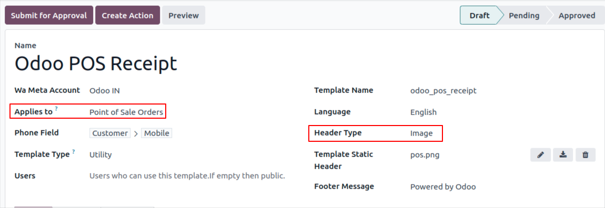
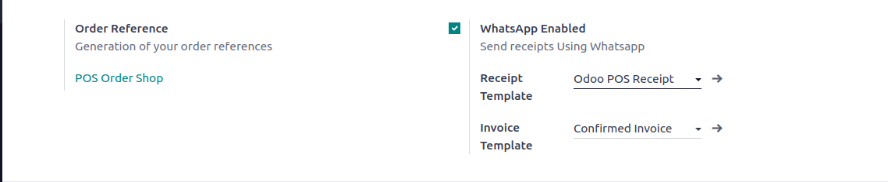

========================================
WhatsApp Template With POS Configuration
========================================

Create Template
---------------

Create a :doc:`Template  <../template/template_configuration>` for
:guilabel:`Point of Sale Orders`.

.. important::
   The header type is compulsory to select an :guilabel:`image` for POS.

In POS
------

Go to :menuselection:`pos->configuration->settings`. Enable the boolean
:guilabel:`WhatsApp enabled`.

Start a Session
~~~~~~~~~~~~~~~

After a successful :guilabel:`POS Order`, at the end of the template, :guilabel:`WhatsApp buttons` will be available.

 .. image:: whatsapp_template_pos/wh-receipt.png
    :align: center
    :alt: POS Order Receipt in Odoo POS
